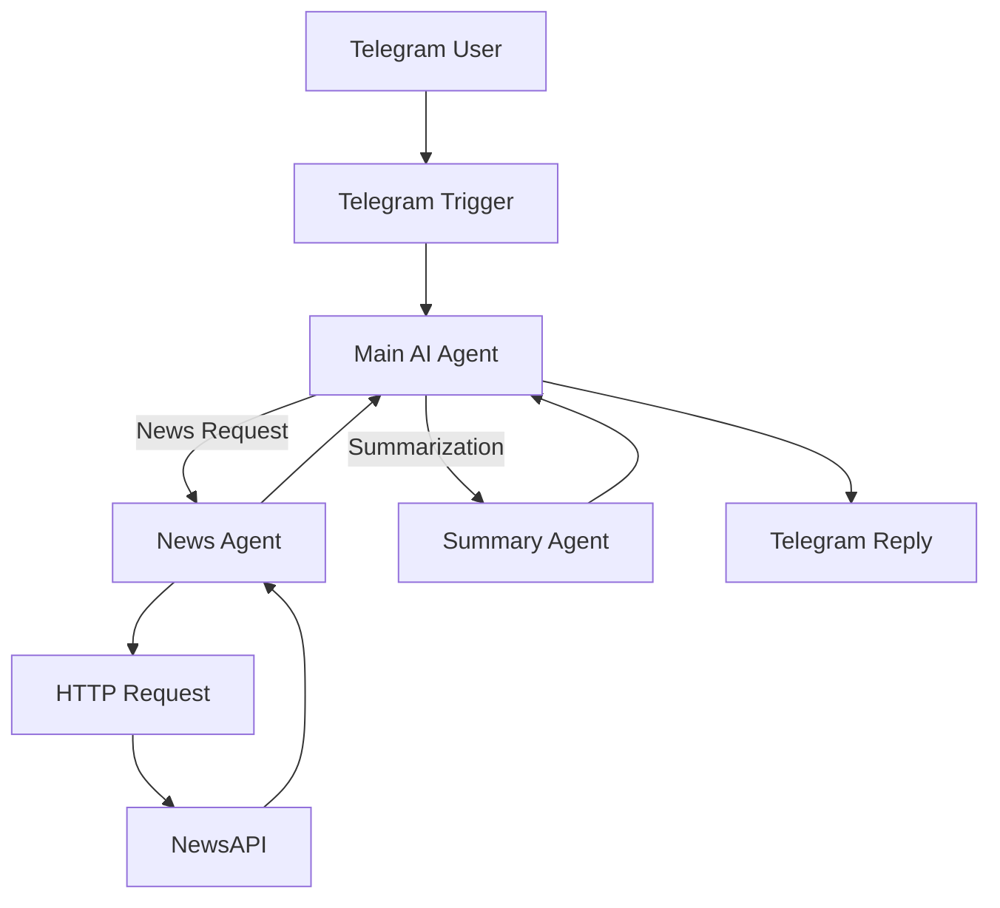
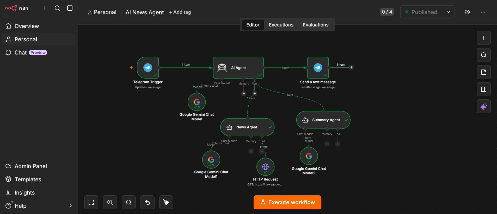

<div align="center">

# 🤖 n8n AI News Telegram Bot

### AI-Powered Multi-Agent Telegram Assistant built with n8n, Google Gemini & NewsAPI

[](https://n8n.io)
[]
[]
[]
[]

**An intelligent Telegram chatbot that retrieves real-time news using AI agents, external APIs, and workflow automation.**

</div>

---

# 📖 Overview

This project demonstrates how **AI Agents** can collaborate inside **n8n** to solve real-world tasks.

The bot understands natural language requests, decides which specialized AI agent should handle them, retrieves live news from **NewsAPI**, summarizes information using **Google Gemini**, and sends formatted responses back to Telegram.

Unlike a traditional chatbot, this workflow showcases **tool calling**, **agent orchestration**, and **API integration** within a low-code automation platform.

---

# ✨ Features

✅ AI-powered Telegram Assistant

✅ Multi-Agent Workflow Architecture

✅ Google Gemini Integration

✅ Live News Retrieval using NewsAPI

✅ AI-generated News Summaries

✅ Intelligent Tool Calling

✅ HTTP API Integration

✅ Low-Code Workflow Automation

---

# 🏗️ System Architecture


```text
Telegram Trigger
       │
       ▼
Main AI Agent
   ├── News Agent
   └── Summary Agent
        │
        ▼
HTTP Request
        │
        ▼
Telegram Send Message
```

# ⚙️ Workflow



---

# 🛠️ Tech Stack

| Technology | Purpose |
|------------|---------|
| **n8n** | Workflow Automation |
| **Google Gemini 2.5 Flash** | AI Reasoning & Tool Calling |
| **Telegram Bot API** | User Interface |
| **NewsAPI** | Live News Retrieval |
| **HTTP Request Node** | API Integration |

---

# 📂 Project Structure

```text
n8n-ai-news-telegram-bot/
│
├── workflow.json
├── workflow.png
├── README.md
└── LICENSE
```

---

# 🚀 How It Works

### Step 1

User sends a message

```
Show me the latest AI news
```

↓

### Step 2

The **Main AI Agent** understands the user's intent.

↓

### Step 3

It delegates the task to the **News Agent**.

↓

### Step 4

The **News Agent** extracts the search topic.

```
AI
```

↓

### Step 5

The HTTP Request node calls

```
https://newsapi.org/v2/everything?q=AI
```

↓

### Step 6

NewsAPI returns live articles.

↓

### Step 7

The AI formats the results into an easy-to-read response.

↓

### Step 8

Telegram delivers the answer to the user.

---

# 📸 Screenshot

## Workflow Overview



---

# 🎯 Example Queries

```
Show me the latest AI news

Technology headlines

News about SpaceX

Latest business news

Summarize this article

Latest sports news
```

---

# 🧠 Skills Demonstrated

- Multi-Agent AI Design

- Prompt Engineering

- Tool Calling

- API Integration

- HTTP Requests

- Telegram Bot Development

- Workflow Automation

- AI Orchestration

- Low-Code Development

---

# ⚠️ Challenges Encountered

During development I encountered several real-world engineering challenges including:

- Gemini API quota limitations (HTTP 429)
- AI tool routing between multiple agents
- Prompt engineering for agent delegation
- HTTP Request tool configuration
- Telegram webhook testing
- Multi-agent workflow debugging

These challenges provided valuable experience in debugging AI workflows and understanding production constraints.

---

# 🚀 Future Improvements

- Weather Agent

- Stock Market Agent

- Email Agent

- Memory Support

- PDF Summarization

- Web Search

- RAG Integration

- Voice Commands

---

# 💻 Installation

## Clone Repository

```bash
git clone https://github.com/cyril-p-jose/n8n-ai-news-telegram-bot.git
```

---

## Import Workflow

Import

```
workflow/telegram-ai-news-bot.json
```

into n8n.

---

## Configure Credentials

Create credentials for:

- Telegram Bot

- Google Gemini

- NewsAPI

---

## Activate Workflow

Enable the workflow.

Open Telegram and start chatting with your bot.

---

# 👨‍💻 Author

## Cyril P Jose

🔗 **GitHub**

https://github.com/cyril-p-jose

🔗 **LinkedIn**

https://www.linkedin.com/in/cyril-p-jose-24889737a

---

# 🤝 Contributing

Contributions, issues, and feature requests are welcome.

Feel free to fork the repository and submit a Pull Request.

---

# ⭐ Support

If you found this project interesting or helpful, consider giving it a ⭐ on GitHub.

It helps others discover the project and motivates further development.

---

# 📄 License

This project is licensed under the MIT License.

---
<div align="center">

Made with ❤️ using n8n, Google Gemini and NewsAPI

</div>
